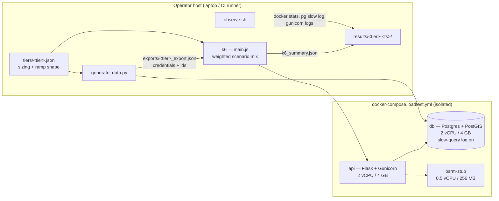

# ADR-0001 — Tiered load-testing harness (k6 + isolated Compose stack + OSRM stub)

- **Status:** Proposed — open for comment
- **Date:** 2026-08-05
- **Introduced by:** [PR #35](https://github.com/BusKa-org/municipal-backend/pull/35)
- **Evidence:** [`loadtest/REPORT.md`](../../loadtest/REPORT.md) (results), [`loadtest/README.md`](../../loadtest/README.md) (how to run)

## Context

BusKá is deployed on a single OpenStack `general.large` VM (4 vCPU / 8 GB) with
the Flask API and Postgres/PostGIS **co-located on that one host**. Before this
work, nobody could answer three questions with evidence:

1. Does the current VM actually hold a real municipality's morning rush?
2. When it eventually breaks, *what* breaks first — Gunicorn, the connection
   pool, or PostGIS?
3. How much room is left before a second município can be onboarded?

School transport has an unusually brutal traffic shape: essentially the entire
user base logs in within the same few minutes before the 5:30–6:00 AM
departure, then GPS pings and live-tracking polls run continuously for about an
hour. Averages are meaningless here; only a burst-shaped test tells the truth.

The constraint that shaped nearly every decision below: **the only real
infrastructure that exists is production.** There is no staging VM, and
provisioning a second one costs real money, so the harness had to produce
useful answers from a laptop or a CI runner while remaining honest about where
that stops being representative.

## Decision

Build a **tiered** harness — Smoke → Baseline → Load → Capacity → Stress →
Breakpoint — where a tier is a JSON file describing real-world sizing (how many
students, how many buses, in which municipality) plus a ramp shape, and a
single k6 orchestrator turns that into a weighted mix of user scenarios. The
system under test runs in a dedicated Docker Compose stack that never touches
production, with every external dependency neutralized.

### Architecture

| Component | Responsibility |
|---|---|
| `loadtest/tiers/*.json` | The only place sizing lives. Each município entry carries a `source_note` recording whether its numbers are a sourced fact or a derived assumption. |
| `loadtest/generate_data.py` | Builds the dataset for a tier directly in the DB. Bulk Core inserts (not per-object ORM adds) so the Breakpoint tier's ~99k students is minutes, not hours. Idempotent per tier: re-running wipes and regenerates only the municípios named in that config. |
| `loadtest/k6/main.js` | Derives per-scenario VU counts from the tier's sizing and applies one ramp shape (`{duration, fraction}` stages) across all scenarios at once. |
| `loadtest/k6/scenarios/*` | One file per user action: auth, student browsing, driver GPS, student geofence GPS, live tracking poll, dashboard reports (default mix) + routing proxy and batch trip generation (opt-in). |
| `loadtest/k6/lib/thresholds.js` | Pass/fail criteria as code, identical at every tier: reads/polling p95 < 300 ms, GPS writes p95 < 500 ms, dashboard p95 < 1500 ms, error rate < 1%. |
| `loadtest/osrm-stub/` | ~150-line stdlib-only OSRM-compatible server returning synthetic straight-line geometry with configurable latency/jitter/error rate. |
| `loadtest/run_tier.sh` | One command per tier: health check → generate data → start observability → run k6 → collect everything into `results/<tier>-<timestamp>/`. |
| `loadtest/observe.sh` | Captures the evidence needed to attribute a failure: `docker stats`, Postgres slow-query log, Gunicorn logs. |

### Why each significant choice was made

**A tiered plan rather than one big test.** Each tier answers a different
question and has a go/no-go gate into the next. It also means a failure is
already bracketed: Baseline passing and Load failing localizes the problem to a
known range instead of producing "it broke somewhere."

**Sizing in JSON, not in the k6 scripts.** The scenarios are about *behaviour*;
the tier files are about *scale*. Separating them means the same six scenario
files serve all six tiers, and re-sizing a tier is a data edit reviewable by
someone who does not read JavaScript. It also forced the `source_note`
discipline — every number is marked as sourced or assumed, so nobody later
mistakes a modelling guess for a researched fact.

**k6 as the generator.** Scenarios are plain JS modules, thresholds are
declarative and live in version control, `ramping-vus` expresses the burst
shapes this domain needs, and it ships as a single binary with a first-party
GitHub Action. Locust and JMeter were not formally benchmarked against it (see
open question 1).

**A dedicated Compose stack, never `docker-compose.prod.yml`.** A load test
that can reach production is one typo away from an outage. The separate file
also lets the stack differ where it must: resource limits, slow-query logging,
and neutralized external services. Limits are set to 2 vCPU / 4 GB per
container — half the prod VM each — to model API and Postgres sharing the one
real host.

**A local OSRM stub instead of the public demo server.** Load-test volumes
against `router.project-osrm.org` would be both rate-limited and a ToS
violation. Self-hosting real OSRM needs a multi-GB regional extract and a long
preprocessing step for no benefit here: `routing_service.py` consumes only
distance, duration, and a coordinate list, and never checks that the geometry
follows real roads. Reaching the stub required one production code change —
`OSRM_BASE_URL` as an environment override, defaulting to exactly the previous
hardcoded URL, so prod behaviour is unchanged unless the variable is set.

**Fake Firebase credentials as a mounted fixture, not a code change.** Firebase
initialization in `create_app()` is unconditional and kills Gunicorn's worker
boot under `FLASK_ENV=production` if credentials are absent. The alternative —
making initialization conditional — is a real behaviour change to production
startup, made to satisfy a test harness. Mounting a syntactically valid but
functionally dead service account keeps the change entirely outside the
application. No exercised endpoint reaches `firebase_admin.messaging.send`,
which is gated behind a per-user `fcm_token` the generated users never set.

**Gunicorn settings became environment-tunable.** Concurrency had to be A/B
tested against one image, which is impossible with values baked into `CMD`.
`GUNICORN_WORKERS` / `_THREADS` / `_WORKER_CLASS` / `_TIMEOUT` default to
exactly the previous `sync`/4/120s, so this is a no-op in production until
someone deliberately overrides it.

**CI runs Smoke and Baseline only, and only on demand.**
`loadtest-regression.yml` is `workflow_dispatch`. A shared GitHub-hosted runner
has neither stable CPU allocation nor enough of it to produce trustworthy
latency numbers at Load scale and above, and a 10–15 minute job on every PR
would be a bad trade. Smoke and Baseline are cheap enough to be worth having as
a manual regression check that the harness itself still works.

**A minimal `db-init/extensions.sql` instead of the repo's `database/init.sql`.**
Mounting the real one fails: its first statement (`CREATE ROLE buska_user`)
errors because `POSTGRES_USER` already created that role, and
`docker-entrypoint.sh` aborts the *entire* init sequence on that failure — so
`uuid-ossp` and `postgis` never get created. This is a latent production bug,
not a load-test-only quirk (see consequence 4 below).

## What this bought us

Recorded here because it is the justification for the harness existing at all;
full numbers and raw-data references are in
[`loadtest/REPORT.md`](../../loadtest/REPORT.md).

- The bottleneck is **CPU on the API container**, confirmed by elimination, not
  guessed: Postgres sat at 0.00–0.04% CPU at every tier while the API pegged
  its limit, with only a handful of slow queries and zero worker timeouts.
- The obvious fix was **tested and rejected**. Eight worker configurations were
  A/B tested; `gthread` was the worst of them (93% failure rate). The workload
  is CPU-bound on JSON serialization and bcrypt, so more workers only add
  contention. Without the harness this would have shipped as a plausible-
  sounding "tune Gunicorn" change that made production worse.
- The real risk is the **burst, not growth**: the same load that runs at 0%
  errors when ramped over two minutes fails ~53% of logins when it arrives in
  ten seconds. That reframes the fix as client-side jittered retry plus CPU
  headroom, rather than anything in the query layer.

## Consequences

**Accepted costs**

1. **The harness is a maintained surface.** New endpoints do not appear in the
   scenario mix by themselves; the mix will drift from reality unless someone
   updates it. `generate_data.py` is also coupled to the models and will break
   on schema changes.
2. **Three production files changed for testability**: `Dockerfile`,
   `app/services/routing_service.py`, `.gitignore`. Each is a defaults-
   preserving no-op, but they are still production files carrying test-driven
   changes.
3. **`loadtest/fixtures/firebase-credentials.fake.json` contains a real
   RSA-shaped private key.** It is synthetic and worthless, but secret scanners
   cannot know that — it is already the top hit when running gitleaks over this
   repo. Whatever secret scanning gets adopted will need this path allowlisted,
   and every future reader will have to be told it is fake.
4. **A production landmine is documented but not fixed.** The
   `database/init.sql` role-creation bug means a from-scratch deploy (new VM,
   disaster recovery) fails at first migration with
   `function uuid_generate_v4() does not exist`. This ADR's stack routes around
   it; production still has it.
5. **Results are not portable across machines.** Absolute latencies depend on
   the host. Comparisons are only valid within a run set on one machine, which
   is why the report always cites the `results/<tier>-<timestamp>/` directory a
   number came from.

**Deliberately out of scope**

6. **Capacity, Stress, and Breakpoint were not run.** Their tier configs are
   written and ready, but a single host running both the load generator and the
   system under test stops being representative at multi-município scale — k6
   would be stealing CPU from the thing it is measuring. These need a second VM
   and a third host for k6. Deferred by decision, not by oversight.
7. **The multi-município tiers model synthetic clones** of one real sourced
   município, using `codigo_ibge` prefixes (`9500xxxx`/`9600xxxx`) that no
   Brazilian state uses. This is a modelling choice, recorded in each tier's
   `source_note`, not a claim that N distinct towns were independently
   researched.

## Open questions / call for comments

Genuine uncertainty — pushback on any of these is wanted, ideally as inline
comments on [PR #35](https://github.com/BusKa-org/municipal-backend/pull/35).

1. **Was k6 the right generator?** It was chosen on properties, not on a
   bake-off against Locust or JMeter. If anyone on the team has operational
   experience with an alternative, that experience probably outweighs the
   comparison done here.
2. **Are the thresholds the right ones?** p95 < 300 ms for reads, < 500 ms for
   GPS writes, < 1500 ms for dashboards, < 1% errors. These are defensible
   defaults, not numbers derived from a product SLO — no SLO exists yet. If the
   product view differs, the thresholds should move, and this is the cheapest
   moment to move them.
3. **Should the modelling fractions be defended better?** The mix assumes 5% of
   students are re-authenticating and 30% are actively watching the live map at
   any moment. Both are our assumptions, flagged as such in `main.js`, and both
   materially change the generated load.
4. **Is a manual-only CI check enough?** The alternative — Smoke on every PR —
   costs ~10 minutes per PR and produces latency numbers too noisy to gate on,
   so it would only ever catch "the harness broke," and would do it slowly.
5. **Should the Firebase fixture exist at all?** Making `create_app()` skip
   Firebase initialization when credentials are absent is arguably the more
   honest fix, would delete a fake private key from the repo, and would remove
   a real crash-on-misconfiguration footgun from production startup. It was
   rejected here only to keep the harness from changing app behaviour.
6. **Who owns re-running this, and when?** A load test that runs once is a
   snapshot, not a safety net. Before onboarding a second município is the
   obvious trigger; whether anything else should trigger it is undecided.
